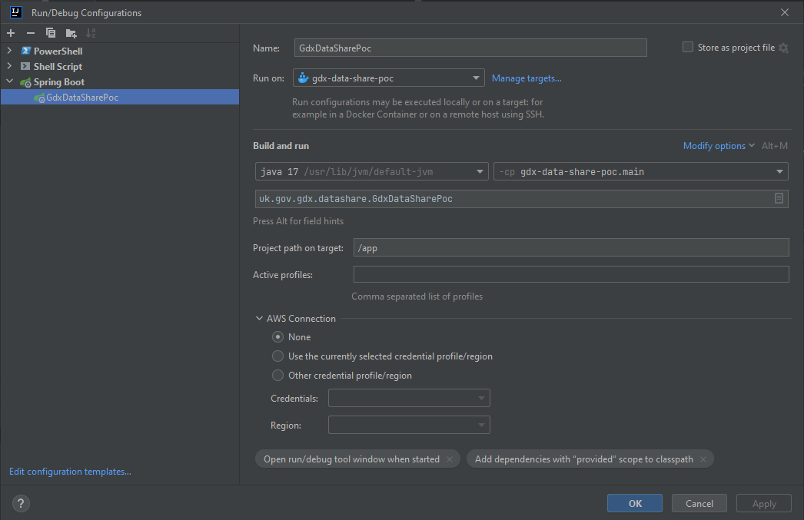

# Contributing

## Onboarding as a developer

- Request access for GitHub
- [Setup AWS access](#aws-access)

### AWS access

In order for access to the AWS console or to perform any terraform manually, you will need to ask GDS for a `gds-users`
account, using the [Request an AWS account form](https://gds-request-an-aws-account.cloudapps.digital).

Select __Request user access__ to request access to the GDS AWS account and complete the form.

After submitting the form, you should receive an email to say your account creation is in progress, and later another
email saying the work has been completed.

Once you have a `gds-users` IAM user, you will need to set up a role for you to assume, this involves going
into `terraform/shared/main.tf` and updating the relevant list with your name. After the next terraform apply, you will
have an account that you can assume role into.

#### Console access

1. Log in to the `gds-users` account
2. Assume your role by:
    1. Navigating to `Switch role` in the dropdown on the top right under your login
    2. In the role switch, enter the correct account and the created role, for example `[name]-admin`
    3. Switch role

#### Terraform access

1. Set up an access key id and secret access key for yourself to access `gds-users`
2. Set up a profile (in my case called gds) in the aws credentials files for that user
3. Set up a profile (in my case called gdx) in the aws config files for the role you have set up in terraform

The files will then look like this:

.aws/credentials

```ini
[gds]
aws_access_key_id = [gds-users access key id]
aws_secret_access_key = [gds-users secret access key]
```

.aws/config

```ini
[profile gds]
region = eu-west-2

[profile gdx]
source_profile = gds
region = eu-west-2
mfa_serial = [MFA arn from gds-users]
role_arn = arn:aws:iam::776473272850:role/[forename].[surname]-admin
```

After this, set up the assume-role plugin from [here](https://github.com/remind101/assume-role).

In order to run terraform or aws cli etc., just run the below and enter the MFA code when prompted

```shell
eval $(assume-role gdx)
```

#### Grafana access

1. Set up a user in the `grafana` user pool in AWS cognito for yourself [here](https://eu-west-2.console.aws.amazon.com/cognito/v2/idp/user-pools/eu-west-2_bM1uLXz8Z/users?region=eu-west-2)
2. Add your user to the Admin group
3. Go to [Grafana](https://non-prod-grafana.share-life-events.service.gov.uk/) and choose to log in with cognito

## Local Development Setup

Requirements

- Java 17 for local running, test running (Coretto recommended - installation instructions can be found in the [README](README.md) under `Working with SAM`)

Generally, development is easier with

- IntelliJ
- Docker, Docker Compose
  and these instructions are based on that

For a new configuration



- From run/debug configurations, create a new Spring Boot configuration
- under "Runs on" select "Docker Compose" under "Create New Target"
- select  `docker-compose.yml` from the root of the repository as the configuration file
- select `gdx-data-share-poc` as the service

- If you have issues running like not being able to find localstack, manually spinning up services may help. In a
  terminal, run

  ```sh
  docker-compose up datashare-db oauth2 localstack -d
  ```
