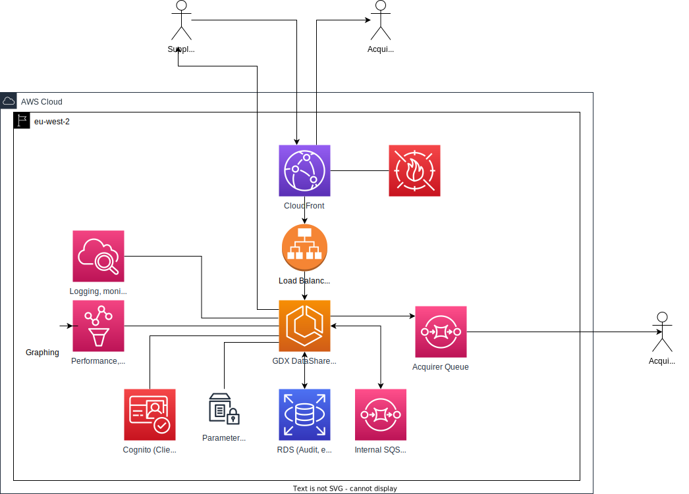
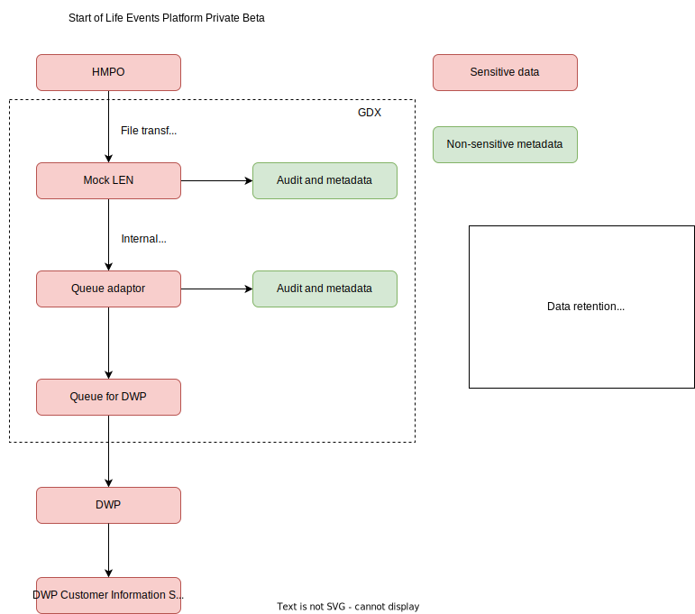

# Architecture

This is a summary of the ADRs across the service, trying to produce a single consolidated view of the as-is system.

## AWS/Infrastructure

A current state view of the overall system architecture and services used in AWS is documented below.

## Stubs/additional services

We currently have a fake version of the supplier side (HMPO), running as

- a Lambda to fetch a file from the GRO SFTP Host
- Mapped using step functions into individual API calls into the CloudFront front end

## Load/Volumes

We're currently working with a limited data set of notifications of death.
Using ONS data, we've worked out what an "average" day looks like, and are targetting ~3,000 notifications a day.

We're currently working with one data acquirer, and one data supplier, so the total data volumes are relatively low currently.

## Event flow

The data model and event process is described in [TechDocs](https://docs.life-events.dev.account.gov.uk/data-model.html).

## Data flow

The data flow is illustrated below.

More detailed data retention policies can be found in our [Data Retention Policy](https://docs.life-events.dev.account.gov.uk/data-retention-policy.html).
