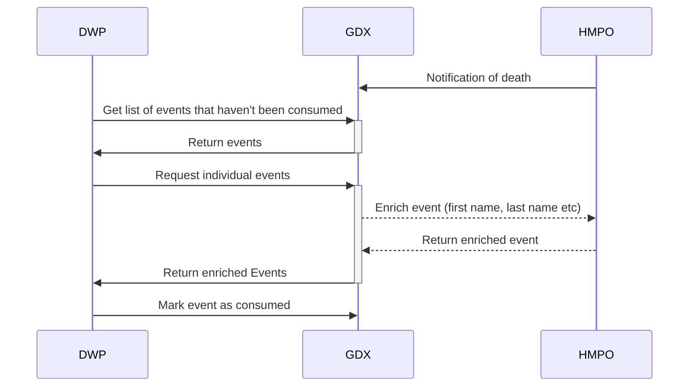

# Architecture

This is a summary of the ADRs across the service, trying to produce a single consolidated view of the as-is system.

## AWS/Infrastructure
A current state view of the overall system architecture and services used in AWS is documented below.

## Data Flows

The overall flows this sytem supports are

## Stubs/additional services

We currently have a fake version of the supplier side (HMPO), running as
- a mock API to look up against in AWS AppRunner
- a mock event API calling the service in AWS Lambda

We also have a mock consumer running as
- a set of Step Functions calling the API

## Load/Volumes

We're currently working with a limited data set of notifications of death.
Using ONS data, we've worked out what an "average" day looks like, and are targetting ~3,000 notifications a day.

We're currently working with one data acquirer, and one data supplier, as well as an internal mock acquirer,
so the total data volumes are relatively low currently.

## Event flow
Events flow through the system as shown in the diagram below.

Each supplier event may result in several acquirer events as the system fans out. These are decoupled from each other early
in the process, and queues are used to provide resiliency. Each supplier event is given an ID, which can be linked to
audit information.
