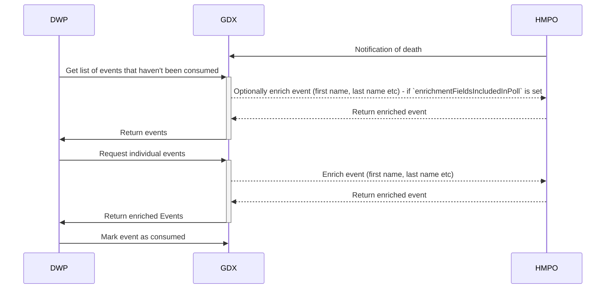

# Architecture

## AWS
A current state view of the overall system architecture and services used in AWS is documented below.

## Data Flows

The overall flows this sytem supports are

## Stubs/additional services

We currently have a fake version of the supplier side (HMPO), running as
- a mock API to look up against in AWS AppRunner
- a mock event API calling the service in AWS Lambda

We also have a mock consumer running as
- a set of Step Functions calling the API
