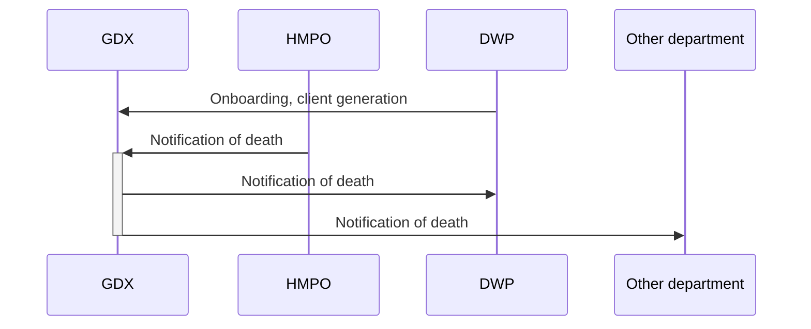
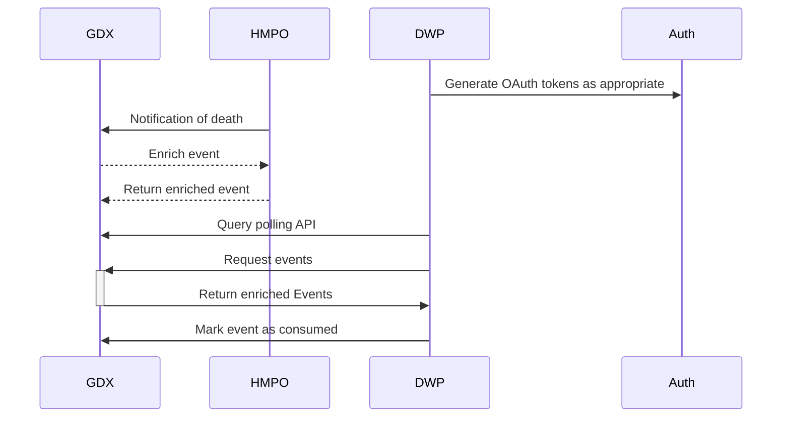

# 5. Queue API

[Next >>](0006-scopes-and-auth.md)


Date: 2023-01-03

## Status

Accepted, see [ADR-0012](0012=delay-enrichment.md) for followup

## Context

There are currently lots of possible areas to investigate for the Proof of Concept, to limit scope and focus design decisions, this is a high level idea of a potential integration route, rather than a complete or fixed approach.

This deliberately doesn't cover the internal architecture of the GDX service, it's purely about the external consumers interface.

## Architecture

The overall flow of the journeys we want to investigate are


NOTE: SEE [ADR-0012](0012=delay-enrichment.md) FOR FOLLOWUP

For this proof of concept, the key API calls will be


## Baseline assumptions
- On-boarding will be a manual process
- Authentication will be through OAuth, all requests will be authenticated
- The output notification stream will be a poll based stream
- The specific features we want to test are
    - whether events fed out of the system are enriched, or more light weight
    - whether a polling based queue achieves the requirements of both parties

## Out of scope

Areas we may want to consider in future
- directly exposing SNS/SQS/similar to consumers
- retrieving data from multiple data sources
- thin client events

## Specific APIs

Fetch the current status of the queue for a given consumer/authentication token

```
GET /events/status
Accept: application/json
Authorization: Bearer {...}
```
Returns
```json
[
  {
    "eventType": "DEATH_NOTIFICATION",
    "count": 100
  }
]

```

### Retrieve notifications

```
GET /events
Accept: application/json
Authorization: Bearer {...}
```

Returns
```json
[
    {
      "eventId": "{guid}",
      "eventType": "DEATH_NOTIFICATION",
      "sourceId": "{death certificate number}",
      "eventData": {
        "firstNames": "",
        ...
      }
    }
]
```

### Retrieve a specific notification

```
GET /events/{guid}
Accept: application/json
Authorization: Bearer {...}
```

Returns
```json
{
  "eventId": "{guid}",
  "eventType": "DEATH_NOTIFICATION",
  "sourceId": "{death certificate number}",
  "eventData": {
    "firstNames": "",
    ...
  }
}
```

### Remove the notification from this consumers queue
allows the underlying system to delete any data held when all consumers have consumed the event
```
DELETE /events/{guid}
Accept: application/json
Authorization: Bearer {...}
```

## Decision

[Next >>](0006-scopes-and-auth.md)
