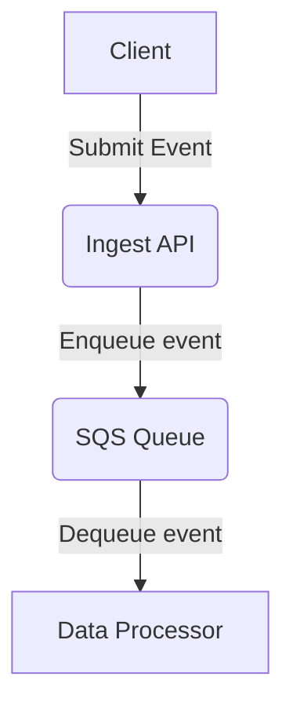

# 9. Use Queues to buffer input events

[Next >>](0010-avoid-reactive-patterns.md)

Date: 2023-01-20

## Status

Accepted

## Context

This partially replaces the ingest flow of [0002](0002-gdx-share-architecture.md).

At the input side of the GDX platform, we expose an API for data providers to submit events.
We currently know and understand the scale of this (around 2,000 death notifications a day), but not exactly when events might be delivered.
As such, having a buffer to enable us to process without massively scaling up/needing rapid scale up should help with overall resilience.

This doesn't fully solve the integration scale, but should we need to, we can replace the ingest API with a scalable Lamdba or similar.

To prevent ingesting fully invalid data, the ingest API should do some lightweight schema validation before enqueuing the event.

## Decision

- use a light weight ingest API
- enqueue events to a queue for further processing and buffering
- dequeue within the wider GDX service

## Consequences

- without splitting the ingest API out into its own scalable service, total throughput is potentially limited

[Next >>](0010-avoid-reactive-patterns.md)
