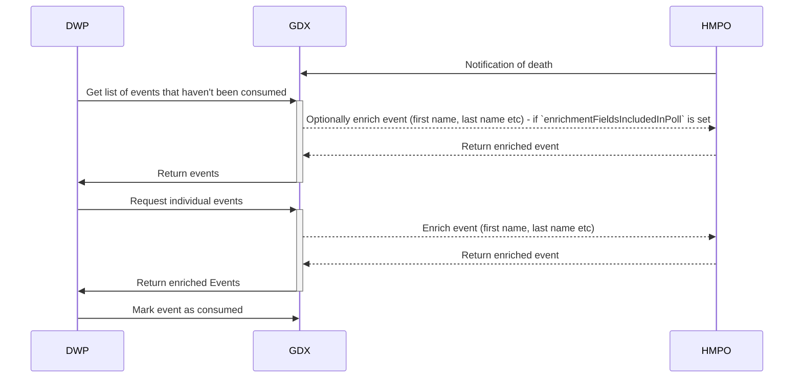

# 12. Delay enrichment calls API

[Next >>](0013-event-auditing.md)

Date: 2023-01-31

## Status

Accepted

## Context

In [ADR-0005](0005-queue-api.md) the architecture suggested retrieving additional provider data early and caching it per consumer.
This was because of a percieved problem performance wise of retrieving data multiple times for consumers.
From discussions around privacy, the concerns of storing data are more significant than the current potential performance problems.

As such, we're going to delay enrichment until data is specifically requested by a client, either through the `/events` endpoint or the `/events/{id}` endpoint.

## Architecture
The resultant flow looks like

## Consequences
We may need to revisit this with future performance concerns, particularly around caching data from upstream services

[Next >>](0013-event-auditing.md)
