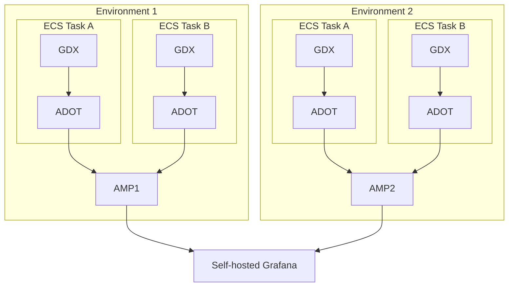

# 15. Monitoring

[Next >>](0016-push-directly-to-sqs.md)

Date: 2023-02-23

## Status

Draft

## Context

The metrics for our system were originally set up to integrate with AWS Cloudwatch, however CloudWatch's concept of
metrics and dimensions is lacking for our purposes as it treats dimensions as just more metrics This means that for some
of our well-designed automated metrics from Micrometer we have a lot of issues aggregating them.

## Decision

We have decided to change this system, to one of using Prometheus to store our metrics and perform alerting, and then
use Grafana to hold our dashboards and allow for metric exploration.

Prometheus was chosen for storage and alerting as it is a leading open source monitoring solution that allows for good
metric and dimension storage and analysis, and it integrates easily with our chosen logging system, micrometer.

Grafana was chosen for dashboards and metric exploration as it has good integration with both AWS services and
Prometheus, and is also an open source solution. It provides powerful metric analysis across dimensions and allows for
alert silencing for Prometheus.

### Prometheus

For our Prometheus, there is a nice service provided by Amazon, Amazon Managed Services for Prometheus (AMP), that we
have decided to use. AMP allows for us to take the metrics from each of our tasks and combine them for an environment
level of metrics. It also allows for convenient terraform IaC for our alerts which are in the AMP AlertManager, that are
then connected to SNS for notification, and can be silenced in our Grafana.

### Grafana

There are 2 ways we could use Grafana, either through Amazon Managed Services for Grafana (AMG) or through our own
self-hosted Grafana instance, hosted in ECS.

Our current decision is to use our own self-hosted Grafana rather than AMG.

AMG as a system has several disadvantages that caused us to go this way:

1. AMG only allows for auth via IdPs that support SAML or AWS IAM Identity Center. This would require us to use
   organisation level IdPs that would require maintenance and oversight from higher up than the GDX team, not currently
   reasonable in our fast-paced iterative approach to development.
2. AMG has restrictive configuration, preventing us from being able to edit and update much of the config that we can
   through our own self-hosted Grafana

In contrast, the self-hosted Grafana does require some initial set up and continued maintenance, however this is
expected to be fairly minor and easy to complete. Also, the self-hosted Grafana still has all the necessary access to
our AMP for things like alert silencing and monitoring (for alerts defined in our AMP), and allows for a much greater
flexibility if we desire in the future to add in more complex configuration.

### Design

The system as described above ends up looking like the below:

Each of the ECS tasks contains both our service (GDX) container and an AWS Distro for Open Telemetry (ADOT) container.

The ADOT container has a Prometheus scraper that scrapes the GDX container for the metrics, which it then publishes to
the AMP for that environment.

Each AMP is then accessed from our single Self-hosted Grafana as a data source, meaning we can monitor the metrics and
alerts for all environments in one place.

## Future risks

The major risks here are the maintenance of the self-hosted Grafana instance that may be performed by AMG automatically.
We expect this to be low risk and cost, as we expect any major breaking updates to require our input for AMG anyway, and
for minor updates the maintenance should be trivial.

[Next >>](0016-push-directly-to-sqs.md)

