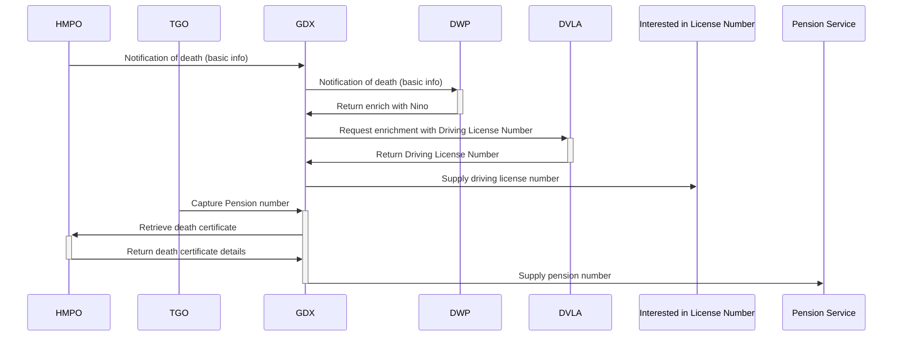

# 18. Data flows

[Next >>](9999-end.md)

Date: 2023-02-28

## Status

Draft for discussion

## Context

We currently have a single pipeline of data from an upstream supplier to a downstream acquirer.
This limits the potential value add for the GDX Service, and makes enriching of data limited.

## Options
There are two touch points we can use to enrich data

- making outbound API calls after receiving an event
- delegating enrichment to external providers, and waiting for an enriched event to pass it on

The first of these is indicated with the GDX->DWP flow below, and the latter in the flow from TGO.
Where GDX can have a high probability of matching, we can reach out directly to data suppliers, enrich data and feed it
on directly.

Where GDX has a low probability of matching, or when some additional citizen supplied data is required, we can instead
delay notification until this data is received, for example, the Pension Number below is known by a citizen, and desired
by departments interested in pensions (e.g. Teachers Pensions). TGO in this scenario can act like any other government department, when a notification of death is received, some offline
processing happens, and eventually feeds an event into GDX to be propagated.

Note, these users of all senses are entirely hypothetical at this point in time, none of this is necessarily real!
## Consequences

Our schema for "data an acquirer is interested in" will need to be extended to include data that needs additional
external retrieval, as well as a different source of data entirely, which may stretch the definition of
`DEATH_NOTIFICATION` - is a notification with `pensionNumber` the same as one with `drivingLicenseNumber`?

[Next >>](9999-end.md)

