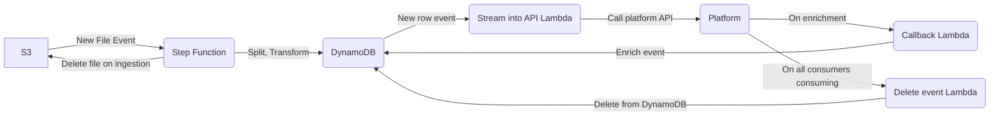
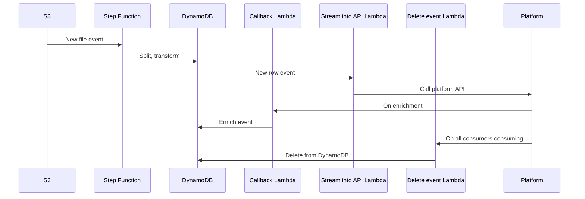

# 24. Flat File Ingestion Proof of Concept

[Next >>](9999-end.md)

Date: 2023-04-20

## Status

Proposed

## Context

We've been exploring possible ways to ingest data, either through a LEN/LEV style API driven approach, or by receiving
a flat file and ingesting that into the Data Exchange platform. 
We currently have access to example flat files, and building out a proof of concept of this approach gives us some ability
to explore and understand the risks/complexities of the approach. 
This work is intended as a proof of concept/provocation piece, rather than as a definite approach or an indication of
future direction.

## Approach

From what we know about the GRO files as a potential source, the data arrives as a single file in an XML format as files into S3, containing multiple individual records, which need to be mapped to a stream of individual events.

The proposed pipeline of data is to
1. recieve a file into an S3 bucket through an as-yet undefined mechanism
2. on receipt, this triggers a Step Function, which
  - maps the flat file into individual events
  - transforms the event format into one we can process later
  - inserts individual entries into DynamoDB
3. New rows in DynamoDB trigger a lamdbda which calls the existing API with a minimal event
4. When an event is processed by a downstream consumer, the platform can request enrichment from the temporary store
5. When all consumers have processed the event, the Platform can notify the temporary store to delete

### Alternatives
AWS Glue/Athena provide a mechanism to query over flat files within an S3 bucket, but this doesn't natively support XML, so there would be a transform stage given the files we know about, and the deletion/minimising of data isn't easily natively supported, so this approach would add additional complexity rather than reducing it.

## Consequences

There are significant privacy and IA risks with taking ownership of data and transforming it, rather than acting purely as a conduit which we need to be aware of, and as part of that
- minimise data storage, and rely on external parties to provide the data in a consistent format
- avoid making decisions on data, e.g. pass each event through rather than trying to collate/combine events

[Next >>](9999-end.md)
