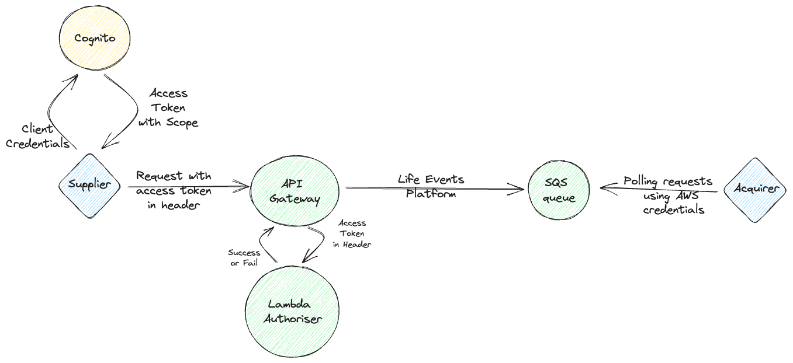

# 30. Serverless Auth

[Next >>](9999-end.md)

Date: 2023-07-31

## Status

Proposed

## Context

With our alignment work with DI and the new architecture, we have had to rebuild our auth services for the new platform.
However, there were no issues with our previous approach, and its wider approach is still appropriate for our service,
so we will be going ahead with a similar approach.

## Approach

We will have 2 separate approaches both based around the logic of having boundaries that we authenticate at, but
different for the supplying of data, and the acquiring of data. For data supplied to the system, our boundary will be our API Gateway, all
data supplied will enter the system via API Gateway. For data acquired from the system, the boundary is the SQS queues that the acquirers
will pull data off of.

### Suppliers

We will have an API Gateway with a custom lambda authoriser. This lambda will authorise the request against Cognito
using `client_credentials` based token auth, passed through in the request's header.

A token will be generated by the supplier using Cognito's token endpoints, and will contain the requisite scope for the
supplier to access their endpoint. This token will be passed in the request in a bearer Authorization header. The lambda
authoriser will strip the token from the header, verify its signature against a Cognito user pool, and then validate
that the request can go to the endpoint it is targeting based on the scope claim on the token. If the scope is correct
then the request will pass through. The scope is set per client, so will be specific to each supplier.

### Acquirers

Our acquirers will be consuming from our SQS queues. For this, we will be using IAM roles with assume role policies, to
allow the acquirers to assume roles with the relevant access to our queues. This includes access to the KMS keys that
will be used to encrypt only their queues.

Acquirers will simply need to provide us with the AWS account and role that they will assume from, and we will let
those roles have access.

### Adaptors

For some of our use cases, we will need to provide adaptors to this flow to allow for other methods of acquiring and
supplying data. For these adaptors, they will exist on top of the existing flow, and the boundaries described above will
still be in place.

The only current case we are planning on is the GRO file transfer. In this case, we will have authenticated and
authorised the data by the time it arrives in our S3 bucket. From here, we will split the file into multiple records
that will each be published through our API Gateway. We will generate our own cognito token in this process with the
relevant claims, and this will be attached on the header for these requests to the API Gateway.

### Diagram

