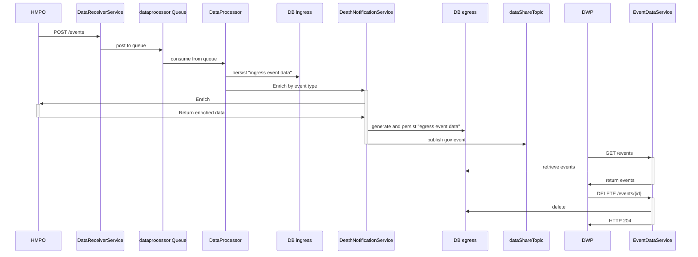

```mermaid
sequenceDiagram

    HMPO ->> DataReceiverService: POST /events
    DataReceiverService ->> dataprocessor Queue: post to queue

    dataprocessor Queue ->> DataProcessor: consume from queue
    DataProcessor->>DB ingress: persist "ingress event data"
    DataProcessor->>+DeathNotificationService: Enrich by event type
    DeathNotificationService->>+HMPO: Enrich
    HMPO->>-DeathNotificationService: Return enriched data

    DeathNotificationService->>DB egress: generate and persist "egress event data"
    DeathNotificationService->>-dataShareTopic: publish gov event

    DWP->>+EventDataService:GET /events
    EventDataService->>DB egress: retrieve events
    EventDataService->>-DWP:return events

    DWP->>+EventDataService:DELETE /events/{id}
    EventDataService->>DB egress: delete
    EventDataService->>-DWP: HTTP 204
```
