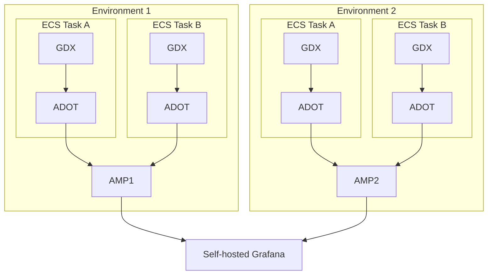

# Monitoring

## Our setup

Our monitoring setup is below

Each of the ECS tasks contains both our service (GDX) container and an AWS Distro for Open Telemetry (ADOT) container.

The ADOT container has a Prometheus scraper that scrapes the GDX container for the metrics, which it then publishes to
the Amazon Managed Services for Prometheus (AMP) for that environment.

Each AMP is then accessed from our single Self-hosted Grafana as a data source, meaning we can monitor the metrics and
alerts for all environments in one place.

## Access

To get access, please read the CONTRIBUTING doc Grafana Access section [here](../../CONTRIBUTING.md#grafana-access).
